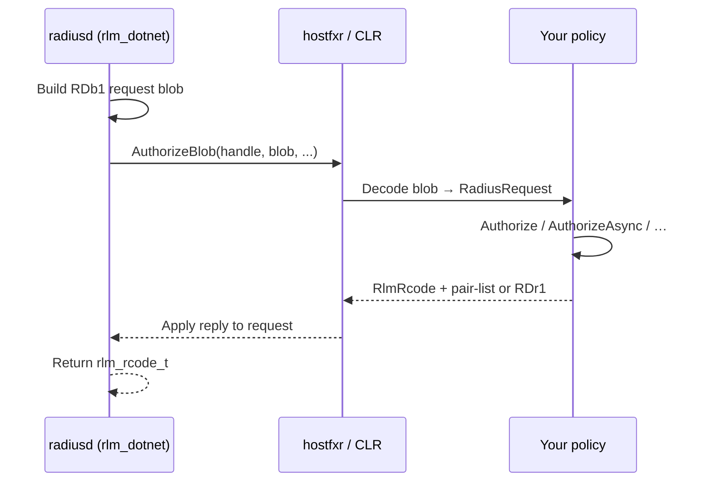

# FreeRADIUS .NET policy SDK (`rlm_dotnet`)

This directory contains the **managed SDK** for writing RADIUS policies in C# on **FreeRADIUS v3** using the native module **`rlm_dotnet`**. The SDK assembly is **`FreeRadius.Dotnet.Interop`**; your business logic lives in one or more **policy assemblies** that implement `IRadiusPolicy` (and optionally `IAsyncRadiusPolicy`).

Native module documentation (wire formats, hostfxr ABI, troubleshooting): [`src/modules/rlm_dotnet/README.md`](../../src/modules/rlm_dotnet/README.md).

---

## What you get

| Capability | Description |
|------------|-------------|
| **In-process .NET 8+** | Policies run inside `radiusd` via `hostfxr` / `nethost` (no separate dotnet process per request). |
| **Rich request model** | Each call receives a `RadiusRequest` with packet, reply, config, session-state, and optional proxy lists. |
| **Flexible replies** | Return a FreeRADIUS **pair-list string** or a binary **`RDr1`** blob for efficient attribute encoding. |
| **Sync and async** | `IRadiusPolicy` for simple code; `IAsyncRadiusPolicy` for HTTP, SQL, LDAP, etc. (native worker still blocks until completion). |
| **Thread modes** | Shared policy instance or **per-thread** factories for `HttpClient` and other thread-affine state. |
| **Logging** | Native `radlog` forwarded as `Action<int, string>` with `RadiusLog` level constants. |
| **Config injection** | `extra_config` JSON passed to your constructor as `JsonElement`. |
| **Metrics** | Optional per-instance call counts, failures, and latency (see module README). |

---

## Repository layout

```text
raddb/mods-config/dotnet/
├── README.md                          ← this file
├── FreeRadius.Dotnet.Interop/         ← SDK source (reference from your policy project)
├── JsonSmoke/                         ← standalone RDb1 parser smoke test
└── JsonSmoke.Tests/                   ← NUnit tests (shared with JsonSmoke)

raddb/mods-available/dotnet            ← sample radiusd.conf module block
src/modules/rlm_dotnet/                ← native C module source + README
```

---

## Quick start

### 1. Build and publish the interop assembly

From the FreeRADIUS repository root:

```bash
dotnet publish -c Release \
  raddb/mods-config/dotnet/FreeRadius.Dotnet.Interop/FreeRadius.Dotnet.Interop.csproj \
  -o raddb/mods-config/dotnet/publish/Release --no-self-contained
```

This produces `FreeRadius.Dotnet.Interop.dll` and `FreeRadius.Dotnet.Interop.runtimeconfig.json` under `publish/Release/`.

### 2. Enable the module

```bash
cd raddb/mods-enabled
ln -s ../mods-available/dotnet .
```

Edit `raddb/mods-available/dotnet` (or your instance copy): set `policy_type` to your class, or use the bundled `ExamplePolicy` for a logging-only demo.

### 3. Reference the module in a virtual server

```text
authorize {
    dotnet
}
```

### 4. Run with debug logging

```bash
radiusd -X
```

With `ExamplePolicy`, you will see request attribute trees at `L_DBG` when the `authorize` section runs.

---

## How a request flows



1. **Boot** — On startup, `rlm_dotnet` loads the CLR, calls `NativeExports.Instantiate` with boot JSON (policy type, `extra_config`, radlog pointer, etc.), and receives a managed **handle**.
2. **Per request** — Native code serializes the current RADIUS lists into an **`RDb1`** v1 binary blob and calls **`AuthorizeBlob`** (one entry point for all sections).
3. **Dispatch** — Managed code parses the blob, inspects `RadiusRequest.Section`, and invokes the matching handler (`Authorize`, `Accounting`, …).
4. **Reply** — Your handler returns an **`RlmRcode`** and reply data (string or `RDr1`). Native code merges attributes into the reply list (or replaces it, per blob flags).

---

## `radiusd.conf` configuration

Full sample: [`raddb/mods-available/dotnet`](../../mods-available/dotnet).

| Option | Required | Description |
|--------|----------|-------------|
| `assembly_path` | yes | Path to `FreeRadius.Dotnet.Interop.dll` (or your policy DLL if it carries exports). |
| `native_exports_type` | yes | Use `NativeExports.TypeName` → `"FreeRadius.Interop.NativeExports, FreeRadius.Dotnet.Interop"` |
| `policy_type` | yes | Your policy class: `"Namespace.Class, AssemblyName"` |
| `runtime_config_path` | no | Directory or path to `.runtimeconfig.json` (default: next to `assembly_path`). |
| `extra_config` | no | JSON **object** merged into boot `extra` (constructor `JsonElement`). |
| `policy_instance_mode` | no | `shared` (default) or `per_thread`. |
| `reply_buffer_size` | no | Max reply bytes (default `65536`). |
| `error_buffer_size` | no | Max error JSON on `RLM_MODULE_FAIL` (default `8192`). |
| `async_timeout_ms` | no | Cancel async policies after N ms (`0` = none). |
| `stats` | no | Per-instance counters (default `yes`). |
| `stats_log_interval` | no | Periodic stats log every N seconds (`0` = detach only). |

**Important:** `SIGHUP` reloads **configuration**, not managed assemblies. After changing any `.dll`, **restart `radiusd`**.

---

## Writing a policy

### Project setup

Create a class library targeting **`net8.0`** (or compatible LTS):

```xml
<Project Sdk="Microsoft.NET.Sdk">
  <PropertyGroup>
    <TargetFramework>net8.0</TargetFramework>
    <Nullable>enable</Nullable>
  </PropertyGroup>
  <ItemGroup>
    <ProjectReference Include="path/to/FreeRadius.Dotnet.Interop.csproj" />
  </ItemGroup>
</Project>
```

Alternatively, reference the published `FreeRadius.Dotnet.Interop.dll` and copy your policy DLL beside the interop DLL in `${modconfdir}/dotnet/publish/Release/`.

### Implement `IRadiusPolicy`

```csharp
using System.Text.Json;
using FreeRadius.Interop;

namespace MyCompany.Radius;

public sealed class MyPolicy : IRadiusPolicy
{
    readonly Action<int, string>? _radlog;

    public MyPolicy(Action<int, string>? radlog, string instanceName, JsonElement extra)
    {
        _radlog = radlog;
    }

    public (int Rcode, string ReplyPairList) Authorize(RadiusRequest request)
    {
        foreach (RadiusVp vp in request.Packet)
        {
            if (vp.Name == "User-Name" && vp.FormatValueForLog() == "blocked")
                return (RlmRcode.Reject, @"Reply-Message := ""Access denied""");
        }
        return (RlmRcode.Ok, IRadiusPolicy.EmptyReply);
    }
}
```

Wire in config:

```text
policy_type = "MyCompany.Radius.MyPolicy, MyPolicy"
```

Use the same **`Namespace.Class, AssemblyName`** format as .NET type resolution (assembly name without `.dll`).

### Preferred constructor

If present, `rlm_dotnet` invokes:

```csharp
public MyPolicy(Action<int, string>? radlog, string instanceName, JsonElement extra)
```

Also supported: `(Action<int, string>, string)`, parameterless, or `Activator.CreateInstance` as a fallback.

### Logging

```csharp
_radlog?.Invoke(RadiusLog.Dbg, "User-Name = " + userName);
```

Debug lines appear when running **`radiusd -X`**. The SDK does not expose a separate “debug enabled” flag; visibility is controlled by the server.

### Section handlers

`IRadiusPolicy` defines methods for each virtual-server section. Unimplemented sections use **default interface methods** (for example `Accounting` returns `Ok` with an empty reply).

| `RadiusRequest.Section` | Interface method |
|-------------------------|------------------|
| `authorize` | `Authorize` |
| `authenticate` | `Authenticate` (default: calls `Authorize`) |
| `preacct` | `Preacct` |
| `accounting` | `Accounting` |
| `session` | `Session` |
| `pre_proxy` / `post_proxy` | `PreProxy` / `PostProxy` |
| `post_auth` | `PostAuth` |
| `recv_coa` / `send_coa` | `RecvCoa` / `SendCoa` |

---

## Async policies (`IAsyncRadiusPolicy`)

Implement **`IAsyncRadiusPolicy`** on the same class when you need `async`/`await` (HTTP, database, etc.). When both interfaces are implemented, the interop layer **prefers async** dispatch.

```csharp
public sealed class MyPolicy : IRadiusPolicy, IAsyncRadiusPolicy
{
    static readonly HttpClient Http = new() { Timeout = TimeSpan.FromSeconds(5) };

    public async ValueTask<(int Rcode, RadiusReply Reply)> AuthorizeAsync(
        RadiusRequest request, CancellationToken cancellationToken = default)
    {
        // Example: call a REST API (configure async_timeout_ms in radiusd.conf)
        using var response = await Http.GetAsync("https://api.example/allow", cancellationToken)
            .ConfigureAwait(false);

        if (!response.IsSuccessStatusCode)
            return (RlmRcode.Reject, RadiusReply.Empty);

        return (RlmRcode.Ok, RadiusReply.FromPairList(@"Reply-Message := ""ok"""));
    }

    // Sync Authorize still required unless you rely on defaults;
    // often delegate to async via GetAwaiter().GetResult() only for tests.
    public (int Rcode, string ReplyPairList) Authorize(RadiusRequest request) =>
        AuthorizeAsync(request).AsTask().GetAwaiter().GetResult() is var r
            ? (r.Rcode, r.Reply.PairList ?? IRadiusPolicy.EmptyReply)
            : (RlmRcode.Fail, IRadiusPolicy.EmptyReply);
}
```

**Caveats:**

- The **RADIUS worker thread blocks** until your `ValueTask` completes (`ConfigureAwait(false).GetAwaiter().GetResult()` inside native code).
- Set **`async_timeout_ms`** to avoid hung outbound calls.
- Use **`IAsyncRadiusPolicy.EmptyResult`** or **`RadiusReply.Empty`** for no-op async replies.

See **`ExamplePolicy`** in this tree for an optional HTTP demo (`extra_config.async_demo_http_url`) and reference helpers (`ExampleBinaryReplyAsync`, `ExampleDatabaseAuthorizeAsync`, `ExampleCoaReply`). Production-style patterns (database, Redis, CoA) are in [**More examples**](#more-examples) below.

---

## Return codes (`RlmRcode`)

Return the first element of the tuple / `Rcode` property. Values **must** match FreeRADIUS `rlm_rcode_t`:

| Constant | Value | Typical use |
|----------|-------|-------------|
| `RlmRcode.Reject` | 0 | Deny the user/request |
| `RlmRcode.Fail` | 1 | Module error |
| `RlmRcode.Ok` | 2 | Success, continue |
| `RlmRcode.Handled` | 3 | Stop processing this section |
| `RlmRcode.Notfound` | 6 | No match |
| `RlmRcode.Noop` | 7 | No opinion |
| `RlmRcode.Updated` | 8 | Success with attribute updates |

Helpers in your policy:

```csharp
return (RlmRcode.Ok, IRadiusPolicy.EmptyReply);           // sync, no reply VPs
return IAsyncRadiusPolicy.EmptyResult;                    // async, via ValueTask
```

---

## Reply modes

### Pair-list string (default)

FreeRADIUS assignment syntax, comma-separated:

```csharp
return (RlmRcode.Ok, @"Reply-Message := ""Welcome"", Session-Timeout := 3600");
```

Async:

```csharp
return (RlmRcode.Ok, RadiusReply.FromPairList(@"Reply-Message := ""ok"""));
// or
return (RlmRcode.Ok, RadiusReply.Empty);
```

### Binary `RDr1` blob (async)

Efficient when returning many attributes or preserving raw encodings:

```csharp
byte[] blob = RadiusReplyBlob.Encode(new[]
{
    RadiusReplyBlob.FromString("Reply-Message", "accepted"),
    RadiusReplyBlob.FromIpv4("Framed-IP-Address", "10.0.0.1"),
    RadiusReplyBlob.FromUInt32("Session-Timeout", 3600),
});
return (RlmRcode.Ok, RadiusReply.FromBlob(blob));
```

VP builders set `PwType` and big-endian wire bytes for you. Default operator is **`RadiusReplyBlob.DefaultReplyOp`** (`T_OP_SET` / `:=`).

---

## More examples

The patterns below are **illustrative** — add the NuGet packages you need to your policy project, keep secrets out of source control, and tune `async_timeout_ms`, `policy_instance_mode`, and pool sizes for production load.

Reference stubs in the interop tree: `ExamplePolicy.ExampleDatabaseAuthorizeAsync`, `ExampleCoaReply`, `ExampleBinaryReplyAsync`.

### Database-backed authorization

Use **`IAsyncRadiusPolicy`** for SQL round-trips. Prefer **`policy_instance_mode = per_thread`** if each policy instance owns a database connection (or use a shared thread-safe pool).

**`extra_config` example:**

```json
{
  "db_connection_string": "Host=db.example;Database=radius;Username=radius;Password=***"
}
```

**Policy sketch (Dapper-style):**

```csharp
using System.Data;
using System.Text.Json;
using Dapper;
using FreeRadius.Interop;
using Npgsql; // or Microsoft.Data.SqlClient, etc.

public sealed class DbPolicy : IRadiusPolicy, IAsyncRadiusPolicy, IDisposable
{
    readonly Action<int, string>? _radlog;
    readonly IDbConnection _db;

    public DbPolicy(Action<int, string>? radlog, string instanceName, JsonElement extra)
    {
        _radlog = radlog;
        string cs = extra.GetProperty("db_connection_string").GetString()
            ?? throw new InvalidOperationException("db_connection_string required");
        _db = new NpgsqlConnection(cs);
        _db.Open();
    }

    public async ValueTask<(int Rcode, RadiusReply Reply)> AuthorizeAsync(
        RadiusRequest request, CancellationToken cancellationToken = default)
    {
        string? user = GetString(request.Packet, "User-Name");
        if (user is null)
            return (RlmRcode.Reject, RadiusReply.Empty);

        // Example query — adapt schema to your deployment
        var row = await _db.QuerySingleOrDefaultAsync<SubscriberRow>(
            new CommandDefinition(
                "SELECT allowed, session_timeout, framed_ip FROM subscribers WHERE username = @user",
                new { user },
                cancellationToken: cancellationToken)).ConfigureAwait(false);

        if (row is null || !row.Allowed)
            return (RlmRcode.Reject, RadiusReply.FromPairList(@"Reply-Message := ""unknown user"""));

        string reply = $@"Reply-Message := ""ok"", Session-Timeout := {row.SessionTimeout}";
        if (row.FramedIp is not null)
            reply += $@", Framed-IP-Address := {row.FramedIp}";

        return (RlmRcode.Ok, RadiusReply.FromPairList(reply));
    }

    public (int Rcode, string ReplyPairList) Authorize(RadiusRequest request) =>
        AuthorizeAsync(request).AsTask().GetAwaiter().GetResult() switch
        {
            var (rc, RadiusReply r) when r.Format == RadiusReplyFormat.PairListString =>
                (rc, r.PairList ?? IRadiusPolicy.EmptyReply),
            var (rc, RadiusReply r) => (rc, IRadiusPolicy.EmptyReply),
        };

    static string? GetString(IReadOnlyList<RadiusVp> list, string name)
    {
        foreach (RadiusVp vp in list)
            if (vp.Name == name && vp.DataType == PwType.String)
                return vp.FormatValueForLog();
        return null;
    }

    public void Dispose() => _db.Dispose();

    sealed record SubscriberRow(bool Allowed, int SessionTimeout, string? FramedIp);
}
```

**Tips:**

- Map `RLM_MODULE_FAIL` on unexpected exceptions; log with `RadiusLog.Err`.
- Use parameterized queries only — never concatenate user input into SQL.
- For high QPS, consider read replicas, connection pooling (e.g. Npgsql Data Source), or a short-lived cache (see Redis below).

### Redis caching

Cache authorization decisions or subscriber profiles to reduce database load. **`StackExchange.Redis.ConnectionMultiplexer` is thread-safe** — safe with `policy_instance_mode = shared`. Use **`per_thread`** only if you prefer one multiplexer per worker.

**`extra_config` example:**

```json
{
  "redis": "redis.example:6379,abortConnect=false",
  "cache_ttl_seconds": 300
}
```

**Cache-aside in `AuthorizeAsync`:**

```csharp
using StackExchange.Redis;
using System.Text.Json;
using FreeRadius.Interop;

public sealed class CachedDbPolicy : IAsyncRadiusPolicy
{
    readonly Action<int, string>? _radlog;
    readonly IDatabase _redis;
    readonly TimeSpan _ttl;

    public CachedDbPolicy(Action<int, string>? radlog, string instanceName, JsonElement extra)
    {
        _radlog = radlog;
        string conn = extra.GetProperty("redis").GetString()!;
        int ttlSec = extra.TryGetProperty("cache_ttl_seconds", out var t) ? t.GetInt32() : 300;
        _ttl = TimeSpan.FromSeconds(ttlSec);
        _redis = ConnectionMultiplexer.Connect(conn).GetDatabase();
    }

    public async ValueTask<(int Rcode, RadiusReply Reply)> AuthorizeAsync(
        RadiusRequest request, CancellationToken cancellationToken = default)
    {
        string? user = GetUserName(request);
        if (user is null)
            return (RlmRcode.Reject, RadiusReply.Empty);

        string key = "radius:sub:" + user;
        RedisValue cached = await _redis.StringGetAsync(key).ConfigureAwait(false);

        SubscriberProfile profile;
        if (cached.HasValue)
        {
            profile = JsonSerializer.Deserialize<SubscriberProfile>(cached!)!;
            _radlog?.Invoke(RadiusLog.Dbg, "redis hit: " + user);
        }
        else
        {
            profile = await LoadFromDatabaseAsync(user, cancellationToken).ConfigureAwait(false);
            await _redis.StringSetAsync(key, JsonSerializer.Serialize(profile), _ttl).ConfigureAwait(false);
            _radlog?.Invoke(RadiusLog.Dbg, "redis miss: " + user);
        }

        if (!profile.Allowed)
            return (RlmRcode.Reject, RadiusReply.Empty);

        return (RlmRcode.Ok, RadiusReply.FromPairList(profile.ReplyPairList));
    }

    // LoadFromDatabaseAsync, GetUserName, SubscriberProfile …
}
```

**Tips:**

- Invalidate cache keys on profile changes (admin API or pub/sub).
- Serialize a small DTO (allowed flag + reply pair-list), not entire `RadiusRequest` objects.
- Set `async_timeout_ms` to cover Redis + DB latency on cache miss.

### Dynamic Change-of-Authorization (CoA)

CoA is handled in the **`recv_coa`** and **`send_coa`** virtual-server sections. Implement **`RecvCoa`** / **`SendCoa`** (sync) or the `*Async` variants to inspect the CoA packet and return reply attributes FreeRADIUS applies to the CoA response.

Typical flow:

1. NAS or another server sends CoA / Disconnect.
2. FreeRADIUS runs your policy in `recv_coa` (or `send_coa` when originating CoA).
3. Your policy returns **`RlmRcode`** and reply attributes (bandwidth change, disconnect, etc.).

**Sync example — adjust session on CoA-Request:**

```csharp
public (int Rcode, string ReplyPairList) RecvCoa(RadiusRequest request)
{
    string? user = GetString(request.Packet, "User-Name");
    string? sessionId = GetString(request.Packet, "Acct-Session-Id");
    if (user is null || sessionId is null)
        return (RlmRcode.Invalid, IRadiusPolicy.EmptyReply);

    // Look up pending action (DB, Redis, message queue) for this session
    CoaAction action = _coaStore.GetPending(sessionId);

    return action.Kind switch
    {
        CoaActionKind.UpdateBandwidth => (
            RlmRcode.Ok,
            $@"Cisco-AVPair := ""subscriber:qos-policy-in={action.InPolicy}"", "
            + $@"Cisco-AVPair := ""subscriber:qos-policy-out={action.OutPolicy}"""
        ),
        CoaActionKind.Disconnect => (
            RlmRcode.Ok,
            @"Reply-Message := ""Administrative disconnect"""
            // Often combined with other modules / unlang to emit Disconnect-Request
        ),
        _ => (RlmRcode.Notfound, IRadiusPolicy.EmptyReply),
    };
}
```

**Async example with `RDr1` (many VPs):**

```csharp
public async ValueTask<(int Rcode, RadiusReply Reply)> RecvCoaAsync(
    RadiusRequest request, CancellationToken cancellationToken = default)
{
    CoaAction action = await _coaStore.ResolveAsync(request, cancellationToken).ConfigureAwait(false);

    RadiusVp[] vps =
    {
        RadiusReplyBlob.FromString("Reply-Message", $"CoA applied: {action.Kind}"),
        RadiusReplyBlob.FromUInt32("Session-Timeout", action.NewTimeout),
    };

    byte[] blob = RadiusReplyBlob.Encode(vps);
    return (RlmRcode.Ok, RadiusReply.FromBlob(blob));
}
```

**`radiusd.conf` — invoke the module on CoA:**

```text
recv-coa {
    dotnet
}

send-coa {
    dotnet
}
```

**Tips:**

- CoA attribute names depend on your dictionary and NAS (Cisco VSA, standard RADIUS, etc.).
- Originating CoA from FreeRADIUS usually involves **`send_coa`** plus other modules (`originate-coa`, `raddb/sites-available/coa`, etc.) — the dotnet policy supplies attributes; unlang orchestrates wire I/O.
- Use `RadiusLog.Dbg` to dump `request.Packet` / `request.ProxyRequest` on first integration.

---

## Request model (`RadiusRequest`)

Built from the native **`RDb1`** v1 blob:

| Property | Content |
|----------|---------|
| `Section` | Active unlang section name (e.g. `authorize`). |
| `Packet` | Incoming RADIUS attributes. |
| `Reply` | Reply list being built (may already contain VPs). |
| `Config` | Control/config pairs. |
| `SessionState` | Session-state list. |
| `ProxyRequest` / `ProxyReply` | Proxy lists (empty if server built without `WITH_PROXY`). |

Each attribute is a **`RadiusVp`**:

- `Name` — dictionary name (e.g. `User-Name`)
- `Tag`, `Op` — RADIUS tag and operator byte
- `DataType` — `PwType` enum (`String`, `Integer`, `Ipv4Addr`, …)
- `RawValue` — exact on-wire bytes (use for round-tripping)
- `FormatValueForLog()` — human-readable debug string (not for security decisions)

Parse blobs yourself only for tests:

```csharp
RadiusRequest req = RadiusRequestBlob.Parse(blobBytes);
```

---

## Threading

| `policy_instance_mode` | When to use |
|------------------------|-------------|
| **`shared`** | Stateless policies or internally thread-safe services. One instance for all workers. |
| **`per_thread`** | Per-worker `HttpClient`, connection pools, or other non-thread-safe state. Native code calls `EnsureThreadPolicy` once per worker thread. |

Policies may implement **`IDisposable`**; called on module detach (per instance in `per_thread` mode).

---

## SDK API reference

### Entry points (do not call from policies)

| Type | Purpose |
|------|---------|
| `NativeExports` | hostfxr exports: `Instantiate`, `Detach`, `EnsureThreadPolicy` |
| `NativeExports.TypeName` | Value for `native_exports_type` in radiusd.conf |
| `NativeExports.ModuleName` | `"rlm_dotnet"` |
| `NativeExports.RequestBlobFormatVersion` / `ReplyBlobFormatVersion` | Wire format version (`1`) |

### Policy contracts

| Type | Purpose |
|------|---------|
| **`IRadiusPolicy`** | Sync handlers; return `(RlmRcode, string pairList)` |
| **`IRadiusPolicy.EmptyReply`** | `""` — no reply attribute changes |
| **`IAsyncRadiusPolicy`** | Async handlers; return `(RlmRcode, RadiusReply)` |
| **`IAsyncRadiusPolicy.EmptyResult`** | `(Ok, RadiusReply.Empty)` |

### Replies

| Type | Purpose |
|------|---------|
| `RadiusReply` | Async reply wrapper (`PairList` or `Blob`) |
| `RadiusReply.Empty` | No-op reply |
| `RadiusReply.FromPairList` / `FromBlob` | Factory methods |
| `RadiusReplyFormat` | `PairListString` or `ReplyBlobV1` |

### Encoding

| Type | Purpose |
|------|---------|
| `RadiusRequestBlob` | Parse `RDb1` → `RadiusRequest` |
| `RadiusReplyBlob` | Build `RDr1` bytes; `FromString`, `FromUInt32`, `FromIpv4` helpers |

### Diagnostics

| Type | Purpose |
|------|---------|
| `RadiusLog` | `L_INFO`, `L_DBG`, … constants |
| `RlmRcode` | Module return codes |
| `SdkOverview` | Assembly metadata (`SdkName`, `SdkVersion`, `ModuleName`) |

### Reference implementation

| Type | Purpose |
|------|---------|
| **`ExamplePolicy`** | Logs all lists (like `rlm_perl` example); optional HTTP demo; pattern helpers for RDr1, CoA, DB |

Generated XML documentation: build Release and open `publish/Release/FreeRadius.Dotnet.Interop.xml` in your IDE.

---

## Wire formats (summary)

### Request `RDb1` v1

- **Magic:** `RDb1`, **version:** `1`, 12-byte header
- **Payload:** section name + `num_lists` (4 or 6) + VP lists
- **VP record:** name, tag, op, flags, `PwType`, raw value

### Reply `RDr1` v1

- **Magic:** `RDr1`, **version:** `1`, flags (`FlagMerge`, `FlagTargetReply`)
- **Payload:** VP count + VP records (same encoding as request VPs)

Full byte layout: [`src/modules/rlm_dotnet/README.md`](../../src/modules/rlm_dotnet/README.md).

---

## Building and testing

### Release build (all projects)

```bash
dotnet build -c Release raddb/mods-config/dotnet/FreeRadius.Dotnet.Interop/FreeRadius.Dotnet.Interop.csproj
dotnet publish -c Release raddb/mods-config/dotnet/FreeRadius.Dotnet.Interop/FreeRadius.Dotnet.Interop.csproj \
  -o raddb/mods-config/dotnet/publish/Release --no-self-contained
```

### JsonSmoke (parser tests without radiusd)

```bash
dotnet run -c Release --project raddb/mods-config/dotnet/JsonSmoke/JsonSmoke.csproj
```

### NUnit

```bash
dotnet test -c Release raddb/mods-config/dotnet/JsonSmoke.Tests/JsonSmoke.Tests.csproj
```

---

## Deployment checklist

1. Publish **interop** and **policy** DLLs to `${modconfdir}/dotnet/publish/Release/` (or paths in `assembly_path` / `policy_type` assembly).
2. Ensure **`.runtimeconfig.json`** sits beside the interop DLL (or set `runtime_config_path`).
3. Match **`native_exports_type`** and **`policy_type`** strings exactly (`Namespace.Type, Assembly`).
4. Rebuild **`rlm_dotnet`** from the same FreeRADIUS tree revision as the interop DLL.
5. **Restart `radiusd`** after any DLL change.
6. Test with **`radiusd -X`** and `stats = yes` while developing.

---

## Troubleshooting (short)

| Symptom | What to check |
|---------|----------------|
| `libhostfxr.so` not found | .NET runtime installed; `DOTNET_ROOT`; re-run `configure` for `rlm_dotnet` |
| AuthorizeBlob not published | Stale interop DLL; rebuild module + republish; restart radiusd |
| Policy not loaded | `policy_type` string; DLL on probing path; constructor throws |
| No debug output | Run `radiusd -X`; use `RadiusLog.Dbg` |
| `RLM_MODULE_FAIL` + JSON | Read `category` / `message` / `stack` from error buffer |
| HUP did not pick up code | **Restart required** for assembly changes |

More detail: [`src/modules/rlm_dotnet/README.md`](../../src/modules/rlm_dotnet/README.md).

---

## Further reading

- Native module: [`src/modules/rlm_dotnet/README.md`](../../src/modules/rlm_dotnet/README.md)
- Sample config: [`raddb/mods-available/dotnet`](../../mods-available/dotnet)
- Example policy source: [`FreeRadius.Dotnet.Interop/ExamplePolicy.cs`](FreeRadius.Dotnet.Interop/ExamplePolicy.cs)
- Advanced patterns: [Database](#database-backed-authorization), [Redis](#redis-caching), [CoA](#dynamic-change-of-authorization-coa)
